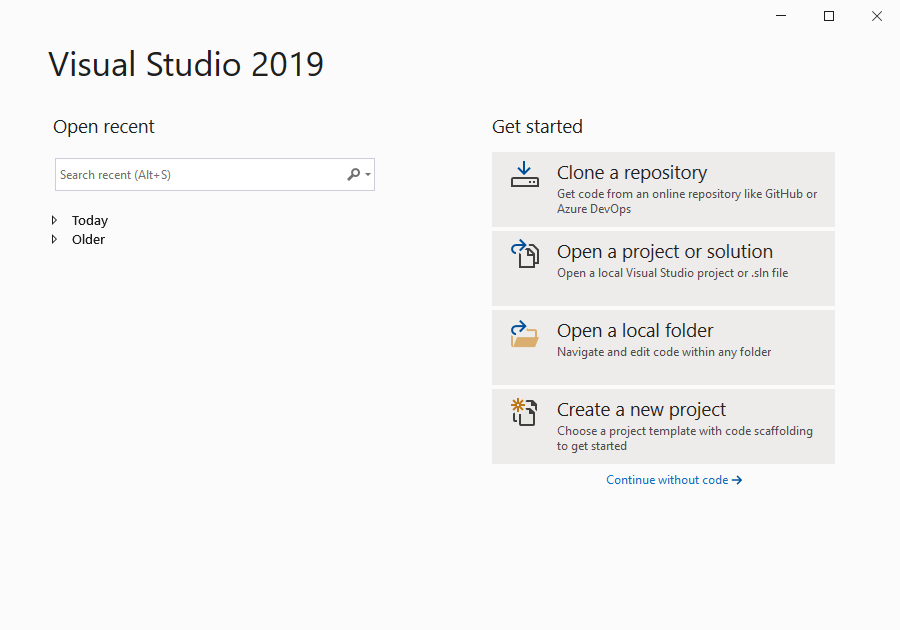
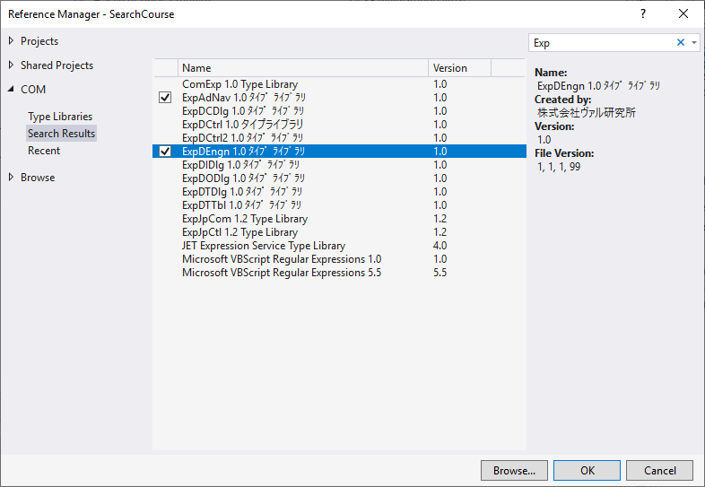

駅すぱあとSDK
===

## Environment

1. Install Visual Studio 2019.
1. Install "駅すぱあとSDK".
1. Open Visual Studio 2019.
1. Choose a "Create a new Project"
  
1. Choose a "Console App (.Net Framework)"
  .PNG)
1. Open Reference Manager. 
  `Solution Explorer > {ProjectName} > (right click) > Add > Reference`
1. Choose a COM as needed.
  
1.  Let's cording!

## References

* https://ekiworld.net/service/sier/sdk/index.html
* https://ekiworld.net/support/download/manual.html#p03
